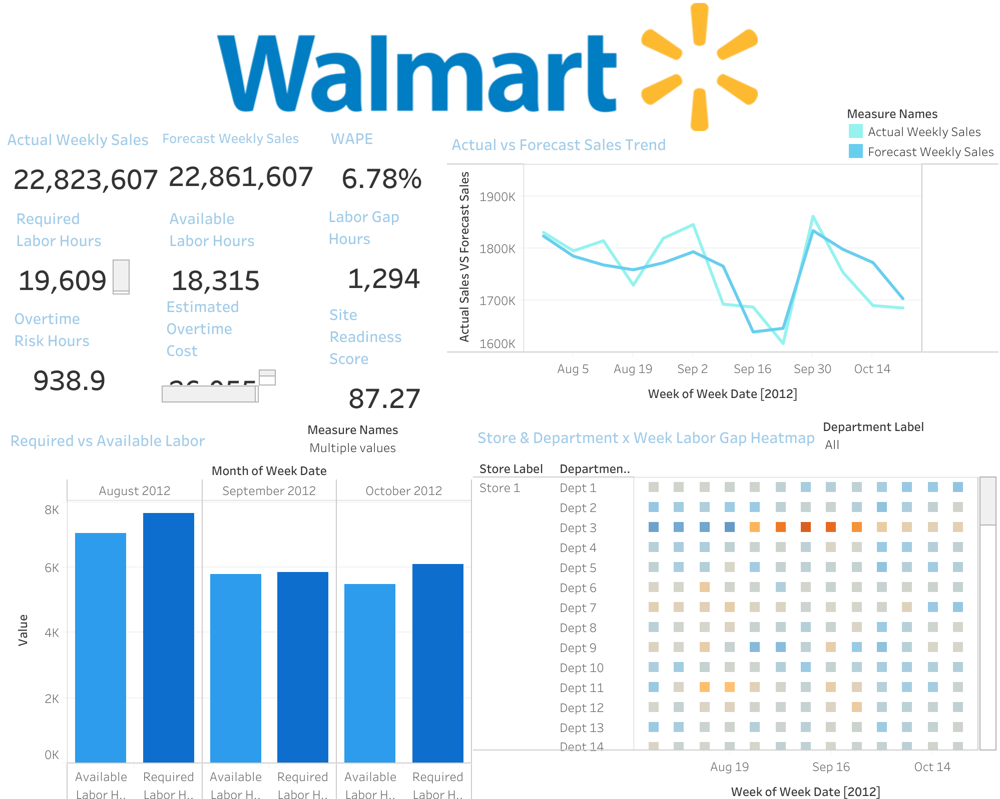

# Retail Sales Forecasting & Workforce Labor Planning Dashboard

## Project Overview

This project connects **retail demand forecasting** with **workforce labor planning** using the Walmart Recruiting Store Sales Forecasting dataset.

The goal of the project is to forecast weekly sales by store and department, convert forecasted demand into labor requirements, compare required labor against available scheduled labor, and identify potential staffing gaps, overtime risk, productivity issues, and site readiness concerns.

This project was built to simulate the type of workforce planning and operational decision support used in large retail environments.

---

## Project Highlights

- Processed **421,570 historical weekly sales records** from Walmart store-department sales data.
- Integrated data across **45 stores**, **81 departments**, and **143 historical sales weeks** from 2010-02-05 to 2012-10-26.
- Loaded **8,190 feature records** containing markdown, fuel price, CPI, unemployment, temperature, and holiday indicators.
- Compared **2 forecasting models**: Ridge Regression and XGBoost Regressor.
- Selected **XGBoost Regressor** as the final model after achieving **7.71% WAPE** on the holdout period.
- Improved forecast WAPE from **8.81% with Ridge Regression** to **7.71% with XGBoost**, a **1.10 percentage-point improvement** and approximately **12.5% relative improvement**.
- Generated **37,865 forecast records** for the 13-week holdout period from 2012-08-03 to 2012-10-26.
- Created simulated labor standards for **81 departments**.
- Created simulated schedule capacity for **37,865 store-department-week records**.
- Built a MySQL workforce planning mart with metrics for labor requirements, staffing gaps, overtime risk, productivity, and site readiness.
- Developed Tableau dashboard views showing forecast accuracy, required vs available labor, labor gap heatmaps, overtime risk, and readiness KPIs.

---

## Business Problem

Retail stores need to align labor capacity with changing customer demand. If staffing is too low, stores may experience overtime risk, lower service levels, productivity issues, and operational strain. If staffing is too high, labor costs may increase unnecessarily.

This project answers questions such as:

- What sales demand is expected by store and department?
- How many labor hours are required to support forecasted demand?
- Which stores or departments are potentially understaffed?
- Where is overtime risk highest?
- Which stores have the lowest readiness scores?
- How can leaders use forecast and labor data to make better staffing decisions?

---

## Tools Used

- **Python**: Data cleaning, feature engineering, model training, forecast generation, and simulated labor input creation
- **XGBoost**: Final forecasting model
- **Ridge Regression**: Baseline comparison model
- **MySQL**: Data warehouse/reporting layer and SQL mart creation
- **SQL**: Joins, transformations, labor calculations, workforce KPIs, validation queries, and business analysis
- **Tableau**: Dashboard development and visualization
- **Pandas / NumPy / Scikit-learn**: Data processing and model evaluation

---

## Dataset

The project uses the Walmart Recruiting Store Sales Forecasting dataset.

Main raw files:

- `train.csv`: Historical weekly sales by store, department, and date
- `features.csv`: Store-level weekly features such as temperature, fuel price, markdowns, CPI, unemployment, and holiday flag
- `stores.csv`: Store type and size
- `test.csv`: Future store-department weeks without actual sales
- `sampleSubmission.csv`: Kaggle submission format

The public dataset does **not** include real labor schedules, wages, labor hours, callouts, or associate-level staffing data. Therefore, labor standards and schedule capacity were simulated for analytical demonstration purposes.

---

## Project Architecture

```text
Raw Walmart CSV Files
        ↓
Python Data Cleaning and Feature Engineering
        ↓
Forecast Model Comparison
        ↓
Best Forecast Output using XGBoost
        ↓
Simulated Labor Standards and Schedule Capacity
        ↓
MySQL Tables
        ↓
SQL Workforce Planning Mart
        ↓
Tableau Dashboard
```

---

## Project Folder Structure

```text
WALMART PROJECT/
│
├── data/
│   ├── raw/
│   │   ├── train.csv
│   │   ├── test.csv
│   │   ├── features.csv
│   │   ├── stores.csv
│   │   └── sampleSubmission.csv
│   │
│   ├── processed/
│   │   ├── forecast_output_all_models.csv
│   │   ├── forecast_output_best.csv
│   │   ├── forecast_output_ridge_regression.csv
│   │   ├── forecast_output_xgboost_regressor.csv
│   │   ├── forecast_output.csv
│   │   ├── model_comparison.csv
│   │   ├── model_metrics.csv
│   │   └── model_metrics.json
│   │
│   └── simulated/
│       ├── labor_standards.csv
│       └── simulated_schedule.csv
│
├── scripts/
│   ├── model.py
│   ├── generated_labor_inputs.py
│   └── load_to_mysql.py
│
├── sql/
│   ├── 01_create_schema.sql
│   ├── 01_drop_existing_mysql.sql
│   ├── 02_create_mart_views_mysql.sql
│   ├── 03_create_indexes_mysql.sql
│   ├── Business_question.sql
│   └── validation.sql
│
├── tableau_and_outputs/
│   ├── mart_workforce_dashboard.csv
│   ├── mart_forecast_accuracy_summary.csv
│   ├── mart_store_week_summary.csv
│   ├── mart_top_at_risk_store_dept.csv
│   └── dashboard_screenshot.png
├── dockerfile
├── .dockerignore
├── docker_compose.yml
├── requirements.txt
└── README.md
```

---

## Methodology

### 1. Data Loading and Preparation

The raw Walmart data was loaded using Python. Sales data was merged with store attributes and external weekly features.

Key preparation steps included:

- Parsing date fields
- Merging sales, store, and feature data
- Handling missing markdown values
- Filling missing economic and weather variables
- Capping negative sales at zero for demand planning purposes
- Creating a clean modeling table at the `store + department + week` level

---

### 2. Feature Engineering

Time-series and retail demand features were created to improve forecast quality.

Features included:

- Store number
- Department number
- Store type
- Store size
- Holiday flag
- Temperature
- Fuel price
- CPI
- Unemployment
- MarkDown variables
- Week of year
- Month
- Quarter
- Lag sales features
- Rolling average sales features

These features helped the model capture seasonal patterns, recent demand trends, holiday effects, and store-level differences.

---

### 3. Forecast Model Comparison

Two models were compared:

- Ridge Regression
- XGBoost Regressor

The models were evaluated using a 13-week holdout period and business-friendly forecast accuracy metrics.

Primary evaluation metric:

```text
WAPE = SUM(Absolute Forecast Error) / SUM(Actual Sales)
```

Model comparison result:

| Model | MAE | WAPE |
|---|---:|---:|
| XGBoost Regressor | 1,225.43 | 7.71% |
| Ridge Regression | 1,400.71 | 8.81% |

XGBoost was selected as the final forecasting model because it produced the lowest WAPE and MAE.

Compared with Ridge Regression, XGBoost reduced WAPE by **1.10 percentage points**, from **8.81% to 7.71%**. This represents an approximate **12.5% relative improvement** in weighted absolute percentage error.

---

### 4. Forecast Output

The selected XGBoost forecast output was saved as:

```text
data/processed/forecast_output_best.csv
```

This file became the official forecast input for the workforce planning layer.

Key forecast output fields included:

- Store
- Department
- Week date
- Actual weekly sales
- Forecast weekly sales
- Forecast error
- Absolute forecast error
- Forecast variance percentage
- Store type
- Store size
- Holiday flag
- External features

---

## Workforce Planning Logic

Because the dataset does not include real labor data, simulated workforce assumptions were created.

The core labor planning formula was:

```text
Forecasted Weekly Sales
÷ Target Sales per Labor Hour
= Required Labor Hours
```

Then:

```text
Required Labor Hours
÷ Average Weekly Hours per Associate
= Required Associates
```

And:

```text
Required Labor Hours
- Available Labor Hours
= Labor Gap Hours
```

Positive labor gap means potential understaffing. Negative labor gap means potential overstaffing.

---

## Simulated Labor Inputs

Two simulated labor input files were created.

### 1. `labor_standards.csv`

This file assigns each department a simulated productivity standard.

Key fields:

- Department
- Volume tier
- Target sales per labor hour

Departments were grouped into low, medium, and high-volume tiers based on historical sales.

### 2. `simulated_schedule.csv`

This file simulates weekly scheduled labor capacity.

Key fields:

- Store
- Department
- Week date
- Scheduled labor hours
- Scheduled associates
- Callout rate
- Flex pool hours
- Average hourly rate
- Average weekly hours per associate

These assumptions were used only to demonstrate workforce planning logic.

---

## MySQL Data Pipeline

MySQL was used as the reporting and transformation layer.

The project loads raw, processed, and simulated data into MySQL tables, then creates SQL views for dashboard reporting.

### Main MySQL Tables

```text
raw_train_sales
raw_features
raw_stores
raw_test_sales

analytics_forecast_output
analytics_model_comparison
analytics_model_metrics
analytics_labor_standards
analytics_simulated_schedule
```

### Main SQL Views

```text
mart_workforce_dashboard
mart_store_week_summary
mart_forecast_accuracy_summary
mart_top_at_risk_store_depts
```

The main Tableau dashboard source is:

```text
mart_workforce_dashboard
```

---

## Data Pipeline Volume

The project pipeline produced the following data assets:

| Data Asset | Row Count | Purpose |
|---|---:|---|
| `raw_train_sales` | 421,570 | Historical weekly sales records |
| `raw_features` | 8,190 | Store-week external features |
| `raw_stores` | 45 | Store metadata |
| `raw_test_sales` | 115,064 | Future store-department weeks |
| `analytics_forecast_output` | 37,865 | XGBoost holdout forecast records |
| `analytics_model_comparison` | 2 | Forecast model comparison results |
| `analytics_labor_standards` | 81 | Simulated department labor standards |
| `analytics_simulated_schedule` | 37,865 | Simulated schedule capacity records |
| `mart_workforce_dashboard` | 37,865 | Final Tableau-ready workforce planning mart |

---

## Workforce Metrics Created in SQL

The SQL mart calculates the following metrics:

- Forecast weekly sales
- Actual weekly sales
- Forecast error
- Absolute forecast error
- WAPE
- Required labor hours
- Required associates
- Scheduled labor hours
- Scheduled associates
- Available labor hours
- Labor gap hours
- Labor gap associates
- Labor coverage percentage
- Overtime risk hours
- Estimated overtime cost
- Productivity sales per labor hour
- Productivity to target percentage
- Site readiness score
- Site readiness status
- Staffing recommendation

---

## Site Readiness Score

A site readiness score was created to summarize operational risk.

The score combines:

- Labor coverage
- Forecast accuracy
- Productivity to target
- Holiday risk adjustment

Readiness categories:

| Score Range | Status |
|---|---|
| 85-100 | Ready |
| 70-84 | Watch |
| Below 70 | At Risk |

This allows leaders to quickly identify which stores or departments may need attention.

---

## Tableau Dashboard

The Tableau dashboard was built using the MySQL mart and exported dashboard data.

Main dashboard source:

```text
mart_workforce_dashboard
```

Supporting outputs:

```text
mart_forecast_accuracy_summary.csv
mart_store_week_summary.csv
mart_top_at_risk_store_dept.csv
```

### Dashboard Preview



---

## Dashboard Snapshot Metrics

The Tableau dashboard summarizes the selected holdout period and shows the following workforce planning KPIs:

| Metric | Value |
|---|---:|
| Actual Weekly Sales | 22,823,607 |
| Forecast Weekly Sales | 22,861,607 |
| Dashboard WAPE | 6.78% |
| Required Labor Hours | 19,609 |
| Available Labor Hours | 18,315 |
| Labor Gap Hours | 1,294 |
| Overtime Risk Hours | 938.9 |
| Average Site Readiness Score | 87.27 |

The model comparison holdout WAPE was **7.71%** for XGBoost. The Tableau dashboard screenshot displays **6.78% WAPE** based on the current dashboard aggregation and filter context.

---

## Dashboard Sections

### 1. Executive Workforce Overview

This section provides high-level workforce KPIs.

KPIs shown:

- Actual weekly sales
- Forecast weekly sales
- WAPE
- Required labor hours
- Available labor hours
- Labor gap hours
- Overtime risk hours
- Estimated overtime cost
- Site readiness score

Charts include:

- Actual vs forecast sales trend
- Required vs available labor hours
- Store and department labor gap heatmap

---

### 2. Forecast Accuracy

This section evaluates the selected forecasting model.

Metrics include:

- WAPE
- Forecast error
- Forecast variance
- Actual vs forecast sales trend

The final model selected was XGBoost because it achieved the best holdout WAPE.

---

### 3. Labor Planning and Overtime Risk

This section identifies where labor capacity may not meet forecasted demand.

Metrics include:

- Required labor hours
- Available labor hours
- Labor gap hours
- Overtime risk hours
- Estimated overtime cost
- Staffing recommendations

---

### 4. Store and Department Drilldown

The dashboard allows users to analyze performance by:

- Store
- Department
- Store type
- Week
- Holiday flag
- Readiness status
- Overtime risk status

---

## Example Business Questions Answered

This project can answer questions such as:

1. Which stores have the highest overtime risk?
2. Which departments are hardest to forecast?
3. Which store-department weeks have the largest labor gaps?
4. How does holiday demand affect labor risk?
5. Which stores have low readiness scores?
6. Where should managers focus staffing adjustments?
7. How do forecasted sales translate into labor-hour requirements?

---

## Key SQL Business Queries

The project includes SQL scripts for validation and business analysis.

Examples:

```sql
SELECT
    store,
    store_type,
    SUM(overtime_risk_hours) AS total_overtime_risk_hours,
    SUM(estimated_overtime_cost) AS total_estimated_overtime_cost,
    AVG(site_readiness_score) AS avg_site_readiness_score
FROM mart_workforce_dashboard
GROUP BY
    store,
    store_type
ORDER BY total_estimated_overtime_cost DESC
LIMIT 10;
```

```sql
SELECT
    dept,
    SUM(actual_weekly_sales) AS actual_weekly_sales,
    SUM(forecast_weekly_sales) AS forecast_weekly_sales,
    SUM(abs_forecast_error) AS abs_forecast_error,
    SUM(abs_forecast_error) / NULLIF(SUM(actual_weekly_sales), 0) AS wape
FROM mart_workforce_dashboard
GROUP BY dept
ORDER BY wape DESC
LIMIT 15;
```

```sql
SELECT
    week_date,
    SUM(required_labor_hours) AS required_labor_hours,
    SUM(available_labor_hours) AS available_labor_hours,
    SUM(labor_gap_hours) AS labor_gap_hours,
    SUM(overtime_risk_hours) AS overtime_risk_hours,
    SUM(estimated_overtime_cost) AS estimated_overtime_cost
FROM mart_workforce_dashboard
GROUP BY week_date
ORDER BY week_date;
```

---

## How to Run the Project

### 1. Clone the Repository

```bash
git clone <your-repository-url>
cd walmart-project
```

### 2. Create a Virtual Environment

```bash
python3 -m venv .venv
source .venv/bin/activate
```

### 3. Install Required Packages

```bash
pip install -r requirements.txt
```

### 4. Configure MySQL Connection

Create a `.env` file in the project root.

Example:

```text
MYSQL_HOST=127.0.0.1
MYSQL_PORT=3306
MYSQL_DATABASE=walmart_workspace
MYSQL_USER=root
MYSQL_PASSWORD=your_mysql_password
```

### 5. Create MySQL Database

```sql
CREATE DATABASE IF NOT EXISTS walmart_workspace;
```

### 6. Run the Python Pipeline

```bash
python scripts/model.py
python scripts/generated_labor_inputs.py
python scripts/load_to_mysql.py
```

### 7. Validate MySQL Tables

```sql
USE walmart_workspace;

SHOW TABLES;

SELECT COUNT(*) FROM mart_workforce_dashboard;
```

### 8. Connect Tableau

Connect Tableau to MySQL using:

```text
Server: 127.0.0.1
Port: 3306
Database: walmart_workspace
Table/View: mart_workforce_dashboard
```

---

## Project Outputs

Final output files are stored in:

```text
tableau_and_outputs/
```

Important output files:

```text
mart_workforce_dashboard.csv
mart_forecast_accuracy_summary.csv
mart_store_week_summary.csv
mart_top_at_risk_store_dept.csv
dashboard_screenshot.png
```

---

## Limitations

This project uses public Walmart sales data and does not include real workforce scheduling data.

The following fields were simulated:

- Labor productivity standards
- Scheduled labor hours
- Scheduled associates
- Callout rates
- Average hourly wages
- Flex pool hours

These assumptions are clearly documented and were created to demonstrate workforce analytics logic.

The project should be interpreted as a workforce planning analytics simulation, not a representation of actual Walmart labor schedules.

---

## Key Takeaways

- XGBoost outperformed Ridge Regression, reducing WAPE from **8.81% to 7.71%** on the holdout period.
- The final forecasting output included **37,865 store-department-week predictions**.
- The project converted forecasted demand into **19,609 required labor hours** in the Tableau dashboard view.
- Available scheduled labor was estimated at **18,315 hours**, creating a labor gap of **1,294 hours**.
- The dashboard identified **938.9 overtime risk hours**, helping quantify potential staffing pressure.
- The average site readiness score was **87.27**, placing the dashboard view in the “Ready” range while still highlighting specific store-department labor risks.
- MySQL was used to create a meaningful reporting mart instead of connecting Tableau directly to raw CSV files.
- The final dashboard supports workforce planning decisions by combining forecast accuracy, labor coverage, overtime exposure, and staffing recommendations.

---

## Skills Demonstrated

- Retail demand forecasting
- Time-series feature engineering
- Forecast model comparison
- XGBoost modeling
- MySQL database design
- SQL reporting mart creation
- Workforce planning logic
- KPI development
- Tableau dashboard design
- Business decision support
- Data storytelling

## Docker Backend Pipeline

The backend pipeline is Dockerized using Docker Compose. Docker runs a MySQL 8.0 container and a Python pipeline container.

The Docker pipeline performs the following steps:

1. Starts a MySQL database container
2. Runs the Python forecasting model
3. Generates simulated labor standards and schedule capacity
4. Loads raw, forecast, and simulated data into MySQL
5. Creates SQL mart views for workforce planning analysis

### Run with Docker

```bash
docker compose up --build
---


## Future Improvements

Potential future enhancements include:

- Add more advanced time-series models such as LightGBM, Prophet, or ARIMA-based benchmarks
- Add scenario planning directly into Tableau
- Include department-specific labor assumptions based on operational complexity
- Add automated dashboard refresh from MySQL
- Improve Tableau design with cleaner layout, color consistency, and interactive navigation
- Deploy the final dashboard to Tableau Public
- Add a Streamlit app for interactive workforce scenario plannin
